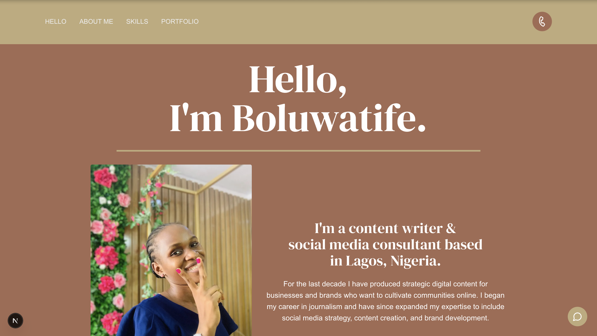
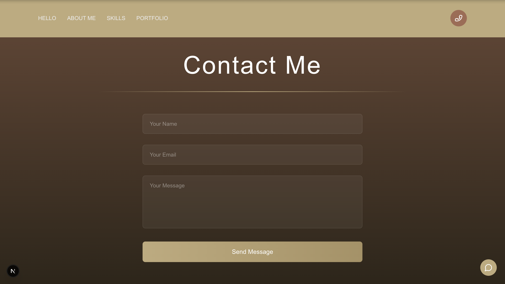

<div align="center">
  <h2 align="center">Social Media Marketing Portfolio</h2>

  This is a sleek, modern, and responsive portfolio built for a social media marketing professional. <br/> Designed to showcase services, testimonials, and marketing success stories. <br/> Built using Next.js and TailwindCSS.

  <a href="https://socialmediaportfolio.vercel.app/"><strong>➥ Live Demo</strong></a>
</div>

<br />

### Demo Screenshots




### Prerequisites

Before you begin, ensure you have met the following requirements:

* [Git](https://git-scm.com/downloads "Download Git") must be installed on your operating system.

### Installing Social Media Marketing Portfolio

To install **Social Media Marketing Portfolio**, run this command on your Git Bash:

Linux and macOS:

```bash
sudo git clone https://github.com/yourusername/social-media-portfolio.git
